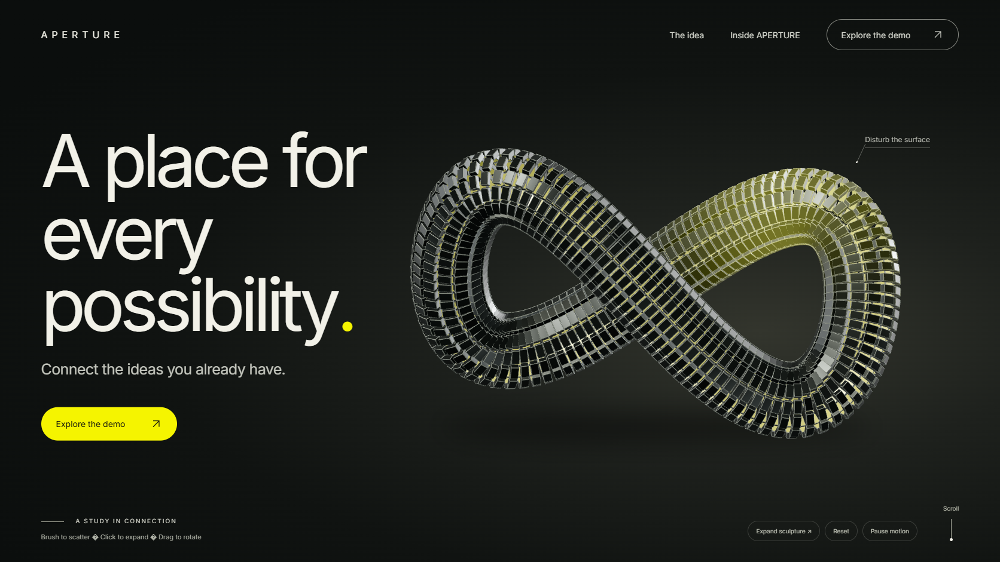
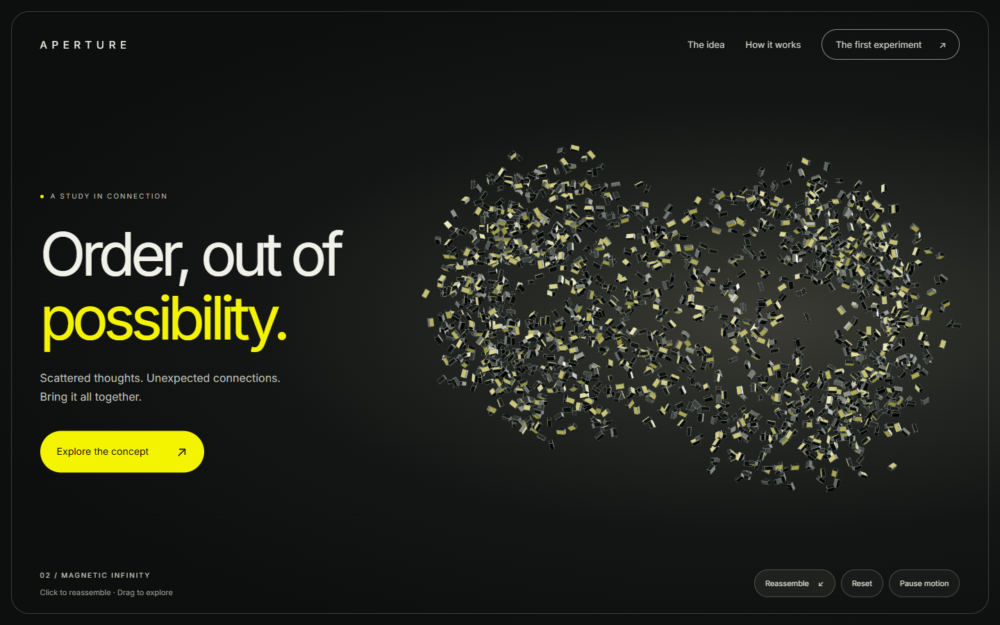
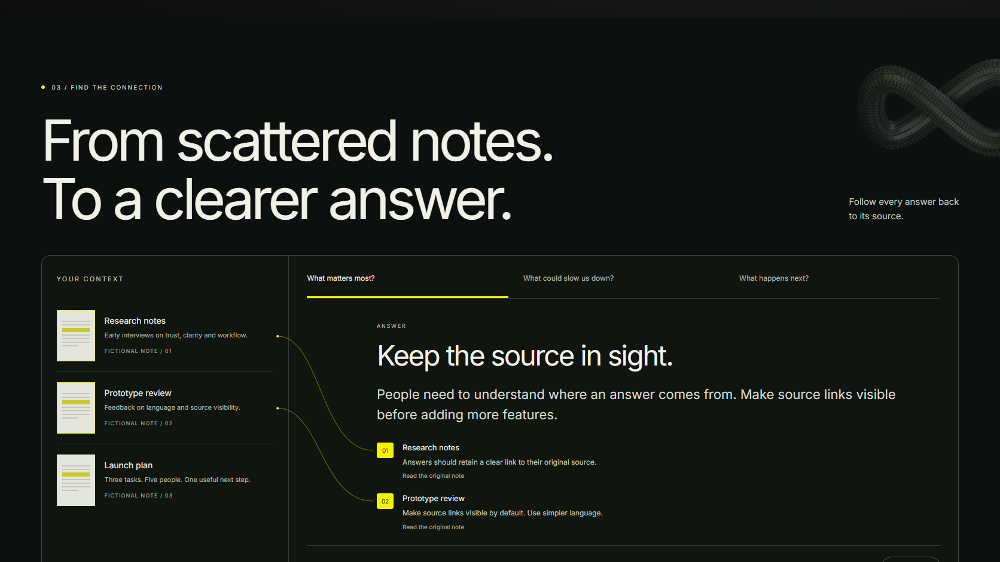
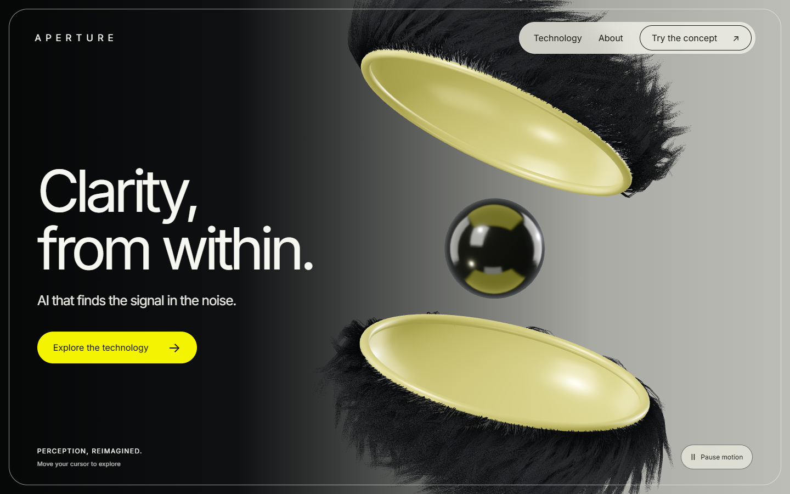
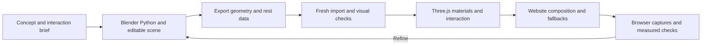

# Blender to Web

**Build living 3D website heroes from editable Blender assets.**

An agent skill, a runnable reference project, and a documented workflow for going from a visual concept to Blender geometry to real-time browser interaction. Created from the APERTURE experiments by Chase AI with Codex.



The infinity above is real geometry in the browser. You can brush its tiles apart, drag to rotate, click to expand and reassemble, and watch a light wave travel around its surface. Scrolling carries it through a story before a working, fictional notebook demo.

[Run the example](#run-the-example) · [Install the skill](#install-the-codex-skill) · [Workflow](references/workflow.md) · [Prompt library](references/prompts.md) · [Blender source](assets/reference-project/outputs/infinity-sculpture/build.py)

## What this does

- Preserves a repeatable process: concept, graybox, detailed model, export, browser interaction, visual comparison and verification.
- Provides editable Blender Python and `.blend` files, an efficient `.glb`, a Three.js website, and still-image fallbacks.
- Demonstrates shared geometry and instancing, local spring motion, click-versus-drag handling, a shader light pulse and scroll storytelling.
- Gives an AI coding agent the asset contracts and lessons it needs to adapt the method to a new design.
- Includes original saved concept/mockup prompts, separately labeled new prompt recipes, and historical validation evidence.

This is a workflow and example code, not a Blender plugin or a one-click converter. Blender physics, hair dynamics, constraints and lighting do not automatically become browser behavior. The runtime implements its own motion and lighting.

## What to install

| What you want to do | Requirements |
| --- | --- |
| View the supplied website | [Node.js](https://nodejs.org/en/download) and a browser; a hardware-accelerated WebGL 2 browser is needed for live 3D |
| Download the repository | Git, or GitHub's **Code → Download ZIP** |
| Use the agent skill | Codex plus this skill; Python 3.10+ for the optional installer/copy helper |
| Rebuild or edit the sculpture | [Blender](https://www.blender.org/download/); reference authored with Blender 5.2.1 LTS |
| Run the saved browser checks | Python, Playwright and installed Google Chrome; see [testing](#testing-and-known-limits) |
| Convert a rebuilt macro render to WebP | Python with Pillow |

The ready-to-run website does **not** require Blender, Figma, a Blender MCP server, an API key, a paid image/video model, or an npm dependency install. Three.js and Inter are included locally with their license notices.

The reference was tested using Node 22.22.2, Python 3.13.7, Windows Chrome and an RTX 5090. Node's current LTS is a suitable starting point for new installs. Other environments need their own performance verification.

## Run the example

```sh
git clone https://github.com/cth9191/blender-to-web.git
cd blender-to-web
node assets/reference-project/outputs/infinity-site/server.cjs
```

Open **http://127.0.0.1:4175/**. Stop the server with `Ctrl+C`. It binds to localhost; this does not publish a website.

If port 4175 is already occupied, choose another port:

```powershell
# Windows PowerShell
$env:PORT = '4180'
node assets/reference-project/outputs/infinity-site/server.cjs
```

```sh
# macOS / Linux
PORT=4180 node assets/reference-project/outputs/infinity-site/server.cjs
```

Then open **http://127.0.0.1:4180/**. Open through the server, not by double-clicking `index.html`.

### Try these interactions

1. Move over the infinity to disturb a local patch of tiles.
2. Click to expand; click again to reassemble.
3. Drag to rotate, then release for damped inertia.
4. Leave it alone to see the yellow light wave.
5. Scroll in a viewport wider than 1000 px to see the sculpture separate and reconnect while the text travels upward.
6. Choose a notebook question, open its source, or copy its answer.
7. Use **Pause motion** or enable reduced motion to inspect the fallback behavior.

Coarse-pointer mobile, reduced-motion and data-saving contexts use a still. Narrow fine-pointer desktop layouts keep the live hero but show the story as normal document sections. Graphics initialization or performance problems may also select a fallback.

## Install the Codex skill

From the cloned repository:

```sh
python scripts/install_skill.py
```

Use `python3` if that is your Python command. The installer respects `CODEX_HOME`, otherwise uses `~/.codex/skills/blender-to-web`. It excludes Git history and refuses to overwrite an existing installation. For a custom location:

```sh
python scripts/install_skill.py --skills-dir /path/to/skills
```

Alternatively, copy this repository's files into a folder named `blender-to-web` inside your Codex skills directory, omitting `.git`. Open a fresh Codex task, then try:

> Use $blender-to-web to create an interactive robotic iris hero for a fictional optics product. Start with a visual direction, design the geometry and interaction contract, and use the APERTURE reference where appropriate.

The skill can guide an agent through the work; it does not guarantee any coding model will reproduce a complex design in one attempt. General Blender specialist skills can complement it, but this repository does not require a particular MCP integration. No provider credential is bundled.

## Start a new project without changing the reference

```sh
python scripts/new_project.py ../my-living-hero
cd ../my-living-hero
node outputs/infinity-site/server.cjs
```

The destination must not already exist. Set `PORT` if the original demo is still running.

The copy includes the editable asset and webpage. Begin by changing one family of decisions: silhouette, tile geometry, material palette, pulse, spring behavior, camera, or page composition. The current runtime expects a specific tile count, ID format and material grouping; [read the asset contract](references/infinity.md) before swapping the GLB.

## Examples from the project

### Magnetic infinity — complete runnable example



A 1,792-piece sculpture built from a shared beveled tile mesh. The export becomes three instanced draw calls in the browser. A fixed-step spring solver handles displacement and return; the light wave uses instance metadata in a shader. The source GLB is about 373 KB.

[Editable Blender file](assets/reference-project/outputs/infinity-sculpture/infinity.blend) · [Builder](assets/reference-project/outputs/infinity-sculpture/build.py) · [Runtime](assets/reference-project/outputs/infinity-site/sculpture.js) · [Technical report](assets/reference-project/outputs/infinity-sculpture/final_report.md)

### Landing page — composition around the sculpture



The example includes the hero, scroll story, source-to-answer connections, a Blender-rendered macro detail and final call to action. The product and notebook answers are fictional; no AI backend is connected. Saved mockups show how the art direction became a working layout.

[Original mockup prompts](assets/reference-project/outputs/landing-page-mockups/prompts.md) · [Design system](assets/reference-project/outputs/infinity-site/DESIGN.md)

### Fiber shell — architecture and source extracts



The earlier shell experiment used a small set of CPU-simulated guides to deform many GPU-rendered fibers. It taught us how to retain the appearance of a groom without delivering a huge baked animation. It approximates soft motion; it does not reproduce Blender Hair Dynamics or strand collisions.

This repository contains selected export/runtime source and historical evidence for that technique, **not the full runnable shell project**. [Read the fiber lessons](references/fibers.md).

## How the workflow fits together



Blender owns the asset. The browser owns the live visitor response. MCP or computer use can assist with inspection, while deterministic scripts preserve the reproducible work. Read [workflow decisions](references/workflow.md) for choosing between instanced parts, skeletons, guide deformation and fixed playback.

Possible next concepts include an iris, articulated robot arm, segmented face or kinetic flower. Those require their own modeling and motion work; they are ideas, not finished examples bundled here.

## Rebuild the Blender asset

Work inside a copy created by `new_project.py`. Put `blender` on PATH or substitute the full executable path. Blender includes the Python environment used by these scripts; do not install `bpy` with pip for this workflow.

```sh
blender --background --python outputs/infinity-sculpture/build.py -- --graybox
blender --background --python outputs/infinity-sculpture/build.py
blender --background --python outputs/infinity-sculpture/validate.py
blender --background --python outputs/landing-build/render_macro.py
```

These scripts create a fresh scene and overwrite generated files beside the scripts. The original render setup explicitly selects **NVIDIA OptiX**. On Apple, AMD, Intel or CPU-only machines, adjust the device-selection block in the builder, validator and macro renderer to the supported backend before running. The included website and `.blend` can be viewed without rerendering.

After rebuilding, copy `outputs/infinity-sculpture/infinity.glb` to `outputs/infinity-site/assets/infinity.glb` and `hero.png` to `outputs/infinity-site/assets/poster.png`. If rebuilding the macro, install Pillow and convert the output:

```sh
python -m pip install Pillow
python -c "from PIL import Image; Image.open('outputs/landing-build/macro.png').save('outputs/infinity-site/assets/macro.webp', quality=90)"
```

See [infinity anatomy](references/infinity.md) for geometry counts, object IDs, pulse ordering and material assumptions.

## Testing and known limits

The saved standalone checks use the [Playwright Python library](https://playwright.dev/python/docs/library):

```sh
python -m pip install playwright
python -m playwright install chromium
```

The historical hardware checks explicitly launch installed **Google Chrome** with Windows D3D11 arguments. Installing Chromium alone does not satisfy that `channel='chrome'` configuration; install Chrome or adapt the scripts for your browser/platform. Software rendering intentionally selects the still, so it cannot validate the live interaction.

With a copied project running on port 4175, run:

```sh
python outputs/landing-build/verify.py
python work/landing-build/check-scroll.py
```

These write screenshot/report evidence and exercise the notebook, scroll, graphics and fallback states. Some copy checks use the isolated browser context's clipboard. Make sure the server on 4175 is the project you intend to test.

- The measured roughly 60 fps result is specific to the local RTX 5090 environment. Physical phones, Safari and integrated GPUs were not verified.
- Spring motion is art-directed. There is no rigid-body collision solver or magnetic-field physics.
- Browser reflections/shadows differ from the Cycles render.
- Historical captures show stages of the project; the latest source includes the subsequent text-scroll refinement.
- Packaging checks tested a fresh copied project. They did not rerun every Blender render.

[Packaging validation](package-validation.json) · [Browser validation](assets/reference-project/outputs/landing-build/validation.json) · [Fresh-import metrics](assets/reference-project/outputs/infinity-sculpture/import-validation.json)

## Repository guide

| Path | Contents |
| --- | --- |
| `SKILL.md` | Agent workflow and routing |
| `references/` | Decisions, asset contract, prompt recipes and fiber source extracts |
| `scripts/` | Safe skill installation and fresh-project copying |
| `assets/reference-project/outputs/infinity-sculpture/` | Blender source, editable scene, export and evidence |
| `assets/reference-project/outputs/infinity-site/` | Complete local website and vendored dependencies |
| `assets/reference-project/outputs/landing-page-mockups/` | Four concept images and their saved prompts |
| `package-manifest.json` | Packaged file sizes and SHA-256 hashes |

To improve the workflow, include the concept, changed asset contract, relevant source changes, a before/after capture and the device/browser used for verification. Keep large future videos/renders out of ordinary Git history; use release artifacts or Git LFS when needed.

## Credits and licensing

No reuse license has been granted for the authored code and assets yet; their reuse rights are reserved. Third-party files retain their existing notices: [Three.js MIT](assets/reference-project/outputs/infinity-site/vendor/three/LICENSE) and [Inter SIL Open Font License](assets/reference-project/outputs/infinity-site/assets/Inter-OFL.txt).

Blender, Three.js, Codex and Figma are independent projects/products; this repository is not an official integration from their maintainers. The package contains our project files and generated reference imagery, not third-party source videos or account cookies.
